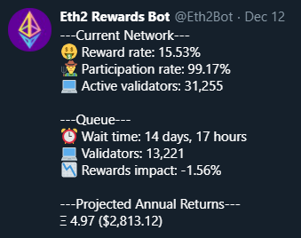

# @Eth2Bot
  
*Example tweet*  

This repository host the code for the @Eth2Bot Twitter account used to track rewards rate, network participation rate, and other statistics about Ethereum 2.0.  

- [Metrics Definitions](#metrics-definitions)  
- [Assumption](#assumptions)  
- [Resources](#resources)
- [Installation Steps](#installation-steps)
- [Contact](#contact)    

## Metrics Definitions

| Metric      | Description |
| ----------- | ----------- |
| 🤑 **Reward Rate**      | Expected reward rate based on current network conditions (more: [Eth2 Calculator](bit.ly/eth2-calc))       |
| 👨‍🌾 **Participation Rate**   | Current participation on Eth2 per Prysm beacon chain API      |
| 💻 **Active Validators**   | `totalSize` of validators per Prysm beacon chain API      |
| ⏰ **Queue Wait Time**   | Time needed for all currently deposited validators to become active. This figure is based on the 900 validator per day activation rate and currently does not account for deposits made after the 2,048 block Eth1 follow distance (i.e. any deposits made within past 7 hours).    |
| 💻 **Queued Validators**   | Number of 32-ETH deposits waiting in the activation queue. This figure currently does not account for deposits made after the 2,048 block follow distance.    |
| 📉 **Reward Impact**   | Impact to reward rate once all queued validators are activated. This is assumes all other network conditions are unchanged from current.    |
| Ξ **Projected Annual Return**   | Projected returns assuming current network conditions remain unchanged (they wont!) for the full year. This value is priced in ETH, and then calculated to USD based on CoinGecko's current ETH/USD market price.    |

## Assumptions
Each of the following assumptions are made to arrive at the projections included in each tweet by the @Eth2Bot bot.
- User's validator is up 97% of the year
- Rewards rate is based on a single validator (32 ETH deposit)
- USD conversion is based on the ETH price at time of tweet
- Rewards rate is annualized
  
## Resources
- Huge thanks to Colin Myers at Codefi for developing the [Eth2 Calculator](bit.ly/eth2-calc) spreadsheet, which is used heavily for by this project.
- [Prysm API](https://api.prylabs.network/#/)

## Installation Steps
1. Make a personal copy of [Eth2 Reward Calc Google Sheet](bit.ly/eth2-calc). This will allow the script to read/write data.
1. Clone this repo with `git clone`.
1. Run `cd Eth2RewardsCalc && npm install` to install npm packages.
1. Run `node sheets_demo.js` to generate an access token and credentials.json file used to edit Google.Sheets.
1. Download the `credentials.json` file and save it to project root directory.
1. Make a copy of `.env.example` and rename to `.env`, and update it with your values.
1. Run the bot using `node twitter.js`.

## Contact
Twitter: @real_Mills  
Eth: ryanmiller.eth